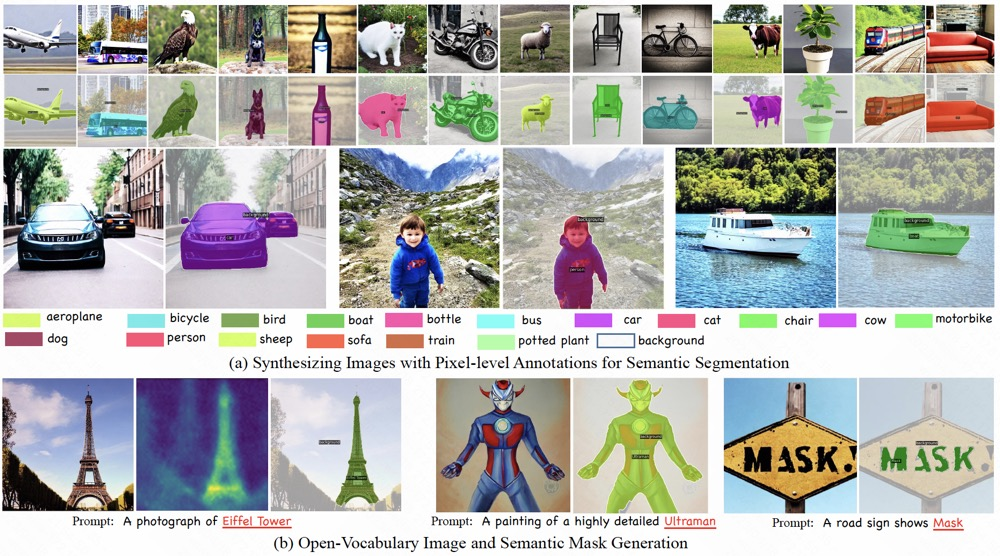

# Awesome-Synthetic-Data-for-Perception-Task  <!-- omit in toc -->
This repository contains a collection of resources and papers on **Awesome-Synthetic-Data-for-Perception-Task**.

   

   

(Source: <a href="https://arxiv.org/abs/2001.10773">Virtual kitti 2</a>, <a href="https://weijiawu.github.io/DiffusionMask/">DiffuMask</a>)

## :paintbrush: Table of Contents <!-- omit in toc -->
- [Generative Model](#Generative-Model)
- [3D Virtual Engine](#3D-Virtual)
- [Classification Task](#Classification-Task)
- [Scene Text Detection & Recognition](#Scene-Text)
- [Semantic Segmentation Task](#Semantic-Segmentation)
- [Instance Segmentation Task](#Instance-Segmentation)
- [Depth Estimation Task](#Depth-Estimation-Task)
- [Open Pose Task](#Open-Pose-Task)
- [Referring Segmentation Task](#Referring-Segmentation)

### Generative Model

+ [Is synthetic data from generative models ready for image recognition?](https://arxiv.org/abs/2210.07574)(ICLR 2023, Spotlight)
  
   

+ [Diversity is Definitely Needed: Improving Model-Agnostic Zero-shot Classification via Stable Diffusion](https://arxiv.org/abs/2302.03298)(Apr 2023)
   

### :bookmark_tabs: 3D Virtual Engine

+ [Virtual kitti 2](https://arxiv.org/abs/2001.10773)(Apr., 2023)  
   
  

